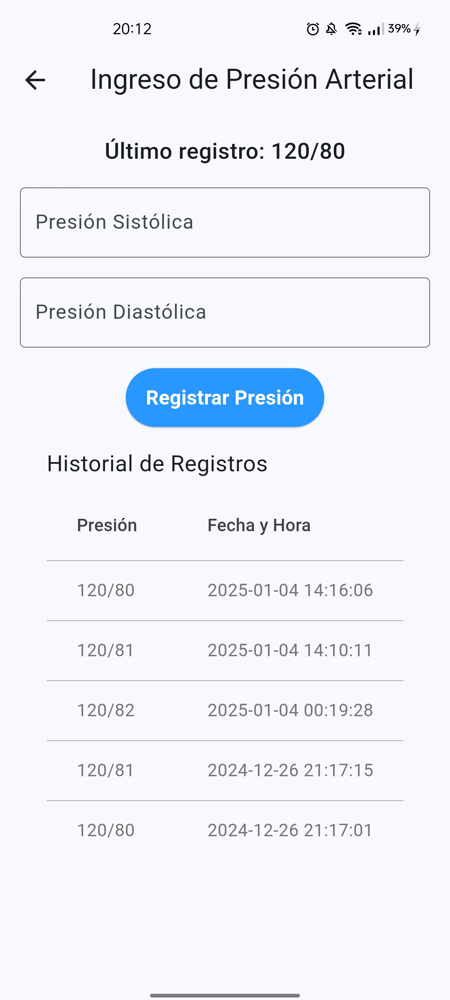

# PreasureCare

La aplicación móvil, llamada PreasureCare, permite a los pacientes registrar su presión arterial y, en base a los rangos ingresados, recibir una dosificación recomendada. Los doctores pueden acceder a un panel de visualización para revisar el historial de presión arterial de todos los pacientes, facilitando el seguimiento y manejo de tratamientos.

## Tecnologías Utilizadas

- **Express.js**: Framework de Node.js utilizado para construir el backend de la aplicación.
- **Flutter**: Framework de desarrollo de aplicaciones móviles utilizado para construir la interfaz de usuario.

## App Móvil Screenshots

  
  
  

## Funcionalidades

- Control de la presion arterial de los paciente.
- Visualización del historial de registros.